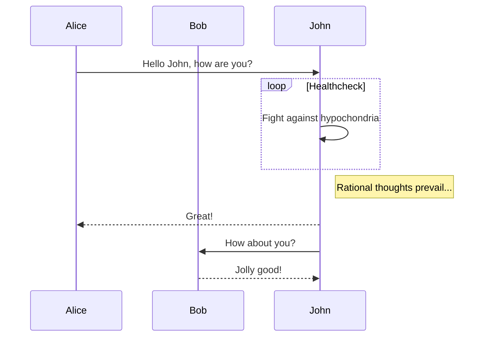

本文介绍一下在 WordPress 中如何使用 markdown 格式发布内容。希望本文对读者有帮助，如果喜欢的话，请点赞收藏。

一、安装 markdown 插件
================

这里强烈推荐我们华人写的 markdown 插件 [Githuber MD](https://github.com/terrylinooo/githuber-md)  
  
可以看到该插件是非常受欢迎，但是到目前为止，在最新的 WordPress 5.9.3 中并未经过测试。通过笔者的踩坑，还是顺利的使用了。  
  
安装之后记得启用。

二、配置插件
======

1. 设置 “写作设定”


如下图所示，在 “设置”、“WP Githuber MD” 中打开 “Markdown” 标签页，在 “写作设定” 中勾选上 “启用 Markdown 编辑器的内容类型” 后面的 “文章” 和“页面”，并执行“保存更改”。  


2. 设置 “模组”
----------

在前面的页面中打开 “模组” 标签页，把除了 “代码高亮 prism.js” 外所有开关打开，并执行“保存更改”。这样就可以拥有很多特性了。**需要注意的是代码高亮不能使用 prism.js，否则像 KaTex 数学公式、MathJax 数学公式、Mermaid 图这些都将不能正常工作。另外，有些第三方主题可能会与其中的一些特性有冲突，比如有些主题自带表情功能，就需要在这里把 “WP Githuber MD” 的 Emojify 特性关掉。**  


3. 设置 “扩充功能”
------------

在 “扩充功能” 标签页，把 “GFM 工作清单” 打开  
  
打开这些功能就与目前大多数的 Markdown 编辑器（比如 Typora，Vditor）支持的功能差不多了（**需要注意的是有些写法有差别，不兼容**），其它功能开关可以根据需要打开。

三、写文章
=====

我们新建一个 Markdown 测试文件，内容如下：

```
### 代码高亮

Php代码

```php
function sayHello() {
	return 'Hello! World.';
}

echo sayHello();
```

C代码
```c
int main() {
	printf("Hello! World.\n");
	return 0;
}
```

### 数学公式

Katex块公式

```katex
f(x) = \int_{-\infty}^\infty\hat f(\xi)\,e^{2 \pi i \xi x}\,d\xi
```

KaTex 行內公式 `$$ f(x) = \int_{-\infty}^\infty\hat f(\xi)\,e^{2 \pi i \xi x}\,d\xi $$`

mathjax块公式

```mathjax
f(x) = \int_{-\infty}^\infty\hat f(\xi)\,e^{2 \pi i \xi x}\,d\xi
```

mathjax行内公式`$ f(x) = \int_{-\infty}^\infty\hat f(\xi)\,e^{2 \pi i \xi x}\,d\xi $`

### mermaid图



### 流程图

```mermaid
flowchat
st=>start: User login
op=>operation: Operation
cond=>condition: Successful Yes or No?
e=>end: Into admin

st->op->cond
cond(yes)->e
cond(no)->op
```

### 顺序图

```seq
A->B: Message
B->C: Message
C->A: Message
```


如下图所示，可以在编写 Markdown 内容的同时在右边看到渲染效果。  


四、设置主题
======


为了正常显示 “内容纲要”，需要设置支持的主题，这里笔者选择的是 “Yocto”：

我推荐的是：elementor


然后查看文章就可以看到最终效果了，如下图所示，可以看到有正常显示 “内容纲要”：  


五、解决可能遇到的问题
===========

公式、图表等不能正常显示，且报错：`Uncaught ReferenceError: jQuery is not defined`
-----------------------------------------------------------------


如果遇到此问题，表明`jQuery`没有正常加载，如下图所示  
  
可以在 “插件文件编辑器”（“插件文件编辑器” 会随着使用的主题不同，可能出现在 “插件” 中，也可能出现 “工具” 中）中选择“WP Githuber MD”，编辑“autoload.php"，在最后添加上`wp_enqueue_script('jquery');`，再执行 "更新文件" 即可。  


  


如果弹出下面的对话框，直接点击 “我明白” 即可。


六、添加文章的阅读次数
===========

添加 “Post Views Counter” 插件：  
  
设置文章类型计数，重置数据间隔设置为 0：  
  
设置显示位置 “在内容之前”，设置图标类：dashicons-visibility  


设置好后就可以看效果了：  
  


WordPress 功能还是相当强大的，各种插件也多，还有许多有趣的东西，这里无法一一介绍，感兴趣的读者可以继续深入研究。
